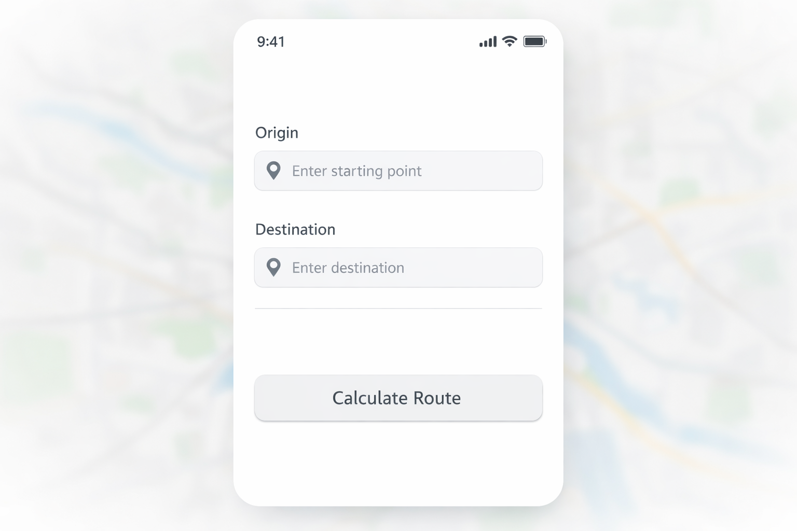

<div align="center">

# 🚀 Sistema Inteligente de Rutas (SIR)


**Planificación de rutas inteligente, sencilla y eficiente.**

[](https://github.com/seculqr1-bit/ruta-inteligente/stargazers)
[](https://github.com/seculqr1-bit/ruta-inteligente/blob/master/LICENSE)
[](https://github.com/seculqr1-bit/ruta-inteligente)

---

[Descripción](#-el-concepto-sir) • [Características](#-características-clave) • [Tecnologías](#-stack-tecnológico) • [Metodología](#-design-thinking) • [Fases](#-hoja-de-ruta)

</div>

---

## 💡 El Concepto SIR

El **Sistema Inteligente de Rutas (SIR)** no es solo un mapa; es una visión de cómo la tecnología puede simplificar nuestra movilidad diaria. En un mundo en constante movimiento, SIR nace de la necesidad de conectar puntos de manera eficiente, eliminando la fricción de la planificación manual.

### ¿Por qué "Inteligente"?
La inteligencia de SIR reside en su capacidad para procesar datos complejos de ruteo y transformarlos en una experiencia de usuario fluida. No se trata solo de ir de A a B, sino de entender el contexto del viaje, el tiempo y la mejor trayectoria posible.

<div align="center">
  
  <p><i>Visualización conceptual del motor de ruteo inteligente de SIR.</i></p>
</div>

---

## ✨ Características Clave

| Característica | Descripción | Estado |
| :--- | :--- | :--- |
| **Ruteo Dinámico** | Cálculo de la trayectoria óptima entre dos puntos geográficos. | 🏗️ En Desarrollo |
| **Estimación de Tiempo** | Cálculo preciso del tiempo de llegada basado en datos reales. | 🏗️ En Desarrollo |
| **Interfaz Minimalista** | Diseño centrado en el usuario para una navegación sin distracciones. | 🎨 Diseñando |
| **Alertas en Tiempo Real** | Notificaciones sobre incidencias o cambios en la ruta. | 📅 Fase 4 |

---

## 🛠️ Stack Tecnológico

Hemos seleccionado herramientas líderes en la industria para garantizar un rendimiento excepcional y una escalabilidad sin límites.

| Componente | Tecnología | Propósito |
| :--- | :--- | :--- |
| **Frontend** | [React](https://react.dev/) / [Vue.js](https://vuejs.org/) | Interfaz de usuario reactiva y moderna. |
| **Backend** | [Python](https://www.python.org/) / [Django](https://www.djangoproject.com/) | Lógica de negocio robusta y segura. |
| **Mapas & Ruteo** | [Mapbox](https://www.mapbox.com/) / [Google Maps](https://developers.google.com/maps) | Motor geográfico y visualización de datos. |
| **Base de Datos** | [PostgreSQL](https://www.postgresql.org/) | Almacenamiento de datos relacional y escalable. |

---

## 🧠 Design Thinking

Nuestra filosofía de desarrollo se basa en el **Design Thinking**, asegurando que cada línea de código resuelva un problema real del usuario.

<div align="center">
  
  <p><i>Prototipado centrado en la simplicidad y la eficiencia del usuario.</i></p>
</div>

1.  **Empatizar:** Escuchamos a quienes se desplazan a diario.
2.  **Definir:** Identificamos los cuellos de botella en la planificación actual.
3.  **Idear:** Creamos soluciones que priorizan la rapidez y la claridad.
4.  **Prototipar:** Construimos versiones rápidas para validar ideas.
5.  **Testear:** Refinamos SIR basándonos en el uso real.

---

## 📅 Hoja de Ruta


*   **Fase 1 (Actual):** Cimentación del proyecto y documentación técnica.
*   **Fase 2:** Lanzamiento del motor de ruteo básico y visualización en mapa.
*   **Fase 3:** Persistencia de datos y perfiles de usuario.
*   **Fase 4:** Sistema de alertas inteligentes y optimización final.

---

## 📂 Estructura del Proyecto

```bash
ruta-inteligente/
├── 📂 docs/          # Documentación técnica profunda
├── 📂 diagrams/      # Arquitectura y flujos en ASCII
├── 📂 assets/        # Identidad visual y recursos
└── 📂 src/           # El corazón del código (Próximamente)
```

---

<div align="center">

### Autores
**Cear Torrecilla** & **Andres Gonzales**

Hecho con ❤️ para mejorar la movilidad del mañana.

[Subir al inicio ↑](#-sistema-inteligente-de-rutas-sir)

</div>
